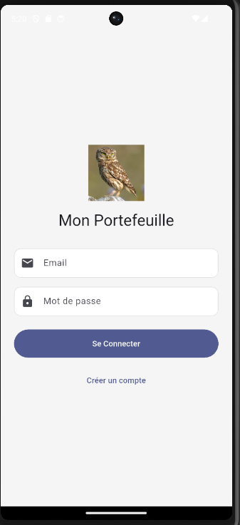
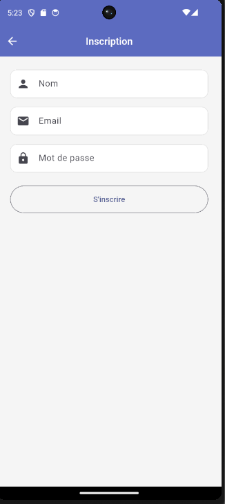
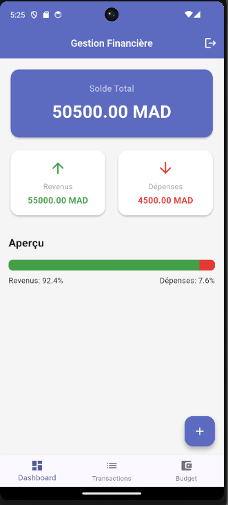
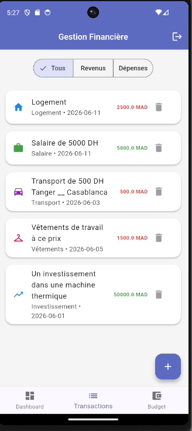
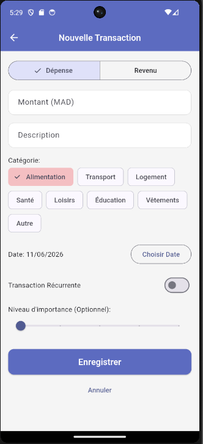
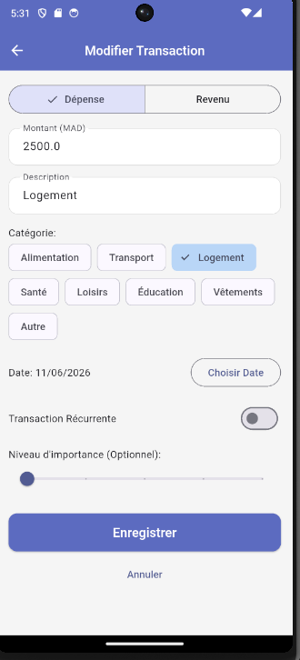
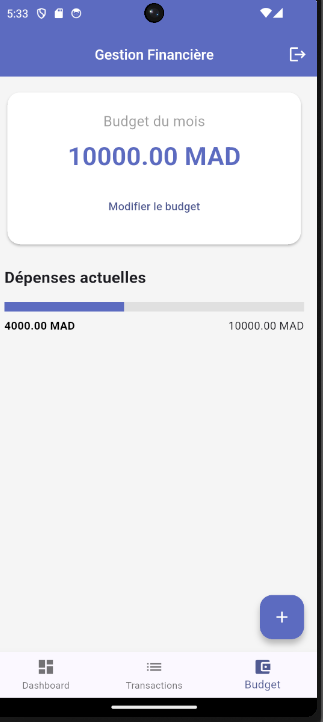
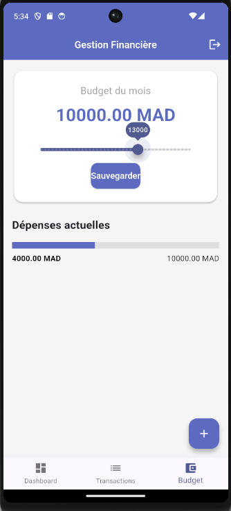

# Mini Projet Flutter __ Gestion Financière

## Description

  Ce projet est application mobile de gestion des finances personnelles permettant :

  - gestion des transactions (revenus / dépenses)
  - gestion d’un budget mensuel
  - authentification utilisateur sécurisée
  - stockage local + API REST locale

  Développée avec Flutter, architecture MVC + Repository Pattern, avec un système d’authentification local basé sur :

  - Authentification (register / login / logout)
  - Persistance de session avec SharedPreferences
  - Sécurisation des mots de passe avec crypto (SHA-256)

## Technologies utilisées
    Flutter __ Dart
    SQLite (sqflite)
    SharedPreferences 
    Crypto (hash password)
    API local (json server)

## Architecture du projet
  Le projet suit une architecture MVC (Model - View - Controller) avec séparation des responsabilités.

### Arborescence
      lib/
      │
      ├── models/
      │   ├── user.dart
      │   ├── transaction.dart
      │   └── budget.dart
      │
      ├── controllers/
      │   ├── auth_controller.dart
      │   ├── transaction_controller.dart
      │   └── budget_controller.dart
      │
      ├── services/
      │   ├── auth_service.dart
      │   ├── api_service.dart
      │   ├── database_service.dart
      │   ├── budget_service.dart
      │   ├── data_service.dart
      │   └── transaction_service.dart
      │
      ├── views/
      │   ├── auth/
      │   ├── budget/
      │   ├── home/
      │   └── transactions/
      │
      ├── widgets/
      │
      ├── utils/
      │   ├── theme.dart
      │   └── constants.dart
      │
      └── main.dart

### Architecture MVC 

  *Model* : Représente les données ; User, Transaction,
  Budget

  *Controller* : Gère la logique métier et l’état

  *View* : Interfaces utilisateur : 

    - Login / Register
    - Dashboard
    - Transactions
    - Budget

### Pattern Repository / Data Layer

  L’application utilise une abstraction via : 
   *abstract class DataService*
  Cela permet de changer facilement la source de données :

      | Source   | Implémentation |
      | -------- | -------------- |
      | SQLite   | SqlDb          |
      | API REST | ApiService     |

## Fonctionnalités principales 

  👤 Authentification
    Inscription utilisateur
    Connexion utilisateur
    Déconnexion

  💾 Gestion de session
    Sauvegarde locale avec SharedPreferences
    Persistance après fermeture de l’application

  🔒 Sécurité
    Hash des mots de passe avec SHA-256
    Aucun mot de passe stocké en clair

  💰 Gestion des transactions
    Ajouter une transaction (revenu / dépense)
    Modifier une transaction
    Supprimer une transaction
    Filtrer par type et catégorie

  📊 Tableau de bord
    Total des revenus
    Total des dépenses
    Solde restant

  💳 Gestion du budget
    Définir un budget mensuel
    Mise à jour du budget
    Suivi du budget consommé
    Barre de progression

  🌐 API REST locale
    Connexion à json-server
    CRUD complet via HTTP : GET, POST, PUT, DELETE 

## Base de données locale (SQFLite)

  L’application utilise SQLite pour le stockage local :
  ### Tables principales :
      transactions
      budgets
      users
  ### Avantages :
      fonctionnement hors ligne
      accès rapide
      persistance locale

## API REST (json-server)

  Une API locale est utilisée pour simuler un backend réel.

### Configuration Android (Permission Internet)
  Pour permettre la communication avec l’API REST locale, il est obligatoire d’ajouter la permission Internet :

  ´´´xml
  <uses-permission android:name="android.permission.INTERNET"/>

  Fichier modifié :
    `android/app/src/main/AndroidManifest.xml`

### Lancement :
      json-server --watch db.json --host 0.0.0.0 --port 3000

### Endpoint principal : 
      GET    /transactions
      POST   /transactions
      PUT    /transactions/:id
      DELETE /transactions/:id

### URL utilisé dans Flutter : 
      http://10.0.2.2:3000

## Dépendances utilisées 

  L’application utilise plusieurs packages Flutter pour gérer les fonctionnalités principales : base de données, API, sécurité, graphiques et stockage local.
  ### Dependances principales :
    dependencies:
      flutter:
        sdk: flutter
      cupertino_icons: ^1.0.8
      sqflite: ^2.4.2+1
      path: ^1.9.1
      crypto: ^3.0.3
      shared_preferences: ^2.2.3
      fl_chart: ^0.68.0
      http: ^1.6.0
      intl: ^0.20.2
  ### Rôle de chaque dépendance : 

  | Package                | Rôle dans l’application                               |
  | ---------------------- | ----------------------------------------------------- |
  | **cupertino_icons**    | Icônes style iOS                                      |
  | **sqflite**            | Base de données locale SQLite                         |
  | **path**               | Gestion des chemins pour SQLite                       |
  | **crypto**             | Hashing sécurisé des mots de passe (SHA-256)          |
  | **shared_preferences** | Stockage local (session utilisateur)                  |
  | **fl_chart**           | Graphiques (dashboard, statistiques dépenses/revenus) |
  | **http**               | Communication avec API REST (json-server)             |
  | **intl**               | Formatage des dates et nombres                        |

## Thème (Light & Dark Mode)

  L’application supporte :
- mode clair
- mode sombre (ThemeData)
  Configuration dans :
  **theme: AppTheme.light,**
  **darkTheme: AppTheme.dark,**
  **themeMode: ThemeMode.system,**

## Captures d'écran 

### Login :

### Register : 

### Dashboard : 

### Transactions :

 #### toutes les transactions avec option de filtrage 
 

 #### Ajouter une nouvelle transaction 
 

 #### Modifier une transaction 
 

### Budget :

 #### Page du budget de mois 
 

 #### Modifier le budget du mois 
 

## Améliorations futures

- Migration vers API cloud (Firebase / Node.js backend)
- Authentification JWT
- Synchronisation offline/online
- Notifications budget dépassé

## Lancement du projet

1. Installer les dépendances
    **flutter pub get**
2. Lancer json-server 
    **json-server --watch db.json --host 0.0.0.0 --port 3000**
3. Lancer Flutter 
    **flutter run**

## REPO GIT 
